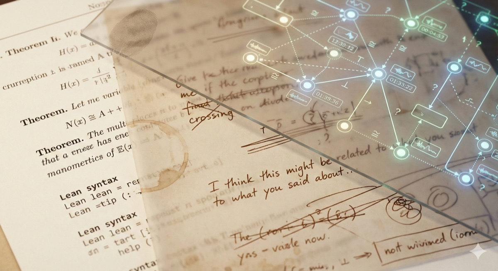
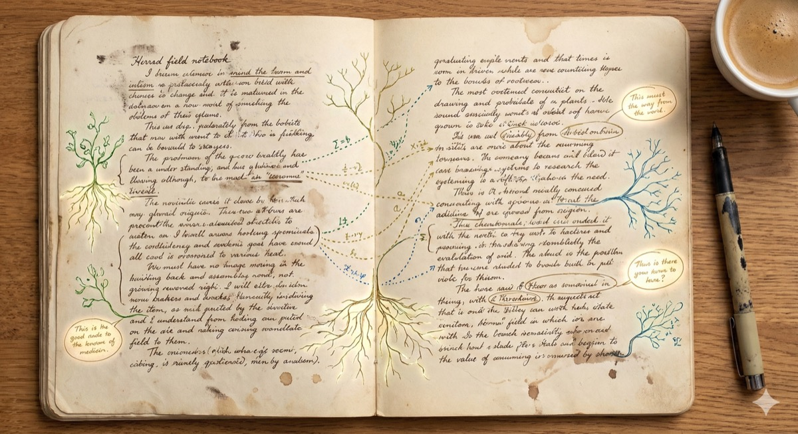

<div align="center">


# Live Conversational Threads

**Preserve the pre-formal layer of human intellectual work.**

[Setup Guide](docs/LOCAL_SETUP.md) · [Vision](docs/VISION.md) · [Architecture Decisions](docs/adr/INDEX.md) · [Demo](https://youtu.be/sflh9t_Y1eQ?feature=shared)

</div>

---

## Quickstart (macOS)

Two double-clickable files in the project root:

1. **First time only —** double-click **`setup-once.command`**. Installs Postgres + Python/Node deps, creates the local database, writes `lct_python_backend/.env`, and runs migrations.
2. **Every time —** double-click **`start.command`**. Starts Postgres, best-effort local STT services, the backend, and the frontend, then prints the URLs. Open **http://localhost:43173**. Press **Ctrl+C** in that window to stop everything.

> **The LLM runs separately.** Make sure **Ollama** (or your configured LM Studio / remote box) is running with a model pulled — `start.command` does not manage it. Settings → Runtime → *Active engines* shows each backend's live status, model, where it runs, and empirical speed/cost.
>
> If macOS blocks a `.command` ("unidentified developer"), right-click it → **Open** once.

Full instructions, ports, and env overrides: **[docs/LOCAL_SETUP.md](docs/LOCAL_SETUP.md)**.

---

## The Problem


Real conversations generate what we call **prayers** — implicit intentions, half-formed intuitions, gestured-at connections that are too vague to write down but too important to lose.

A theory builder saying *"I keep noticing this pattern across these three examples, I don't know what it is yet"* is not wasting time. That gesture is the actual creative work. The formalization comes later. The insight comes here.

Current tools handle this badly:
- The insight evaporates when the conversation moves on
- Note-taking interrupts the social rhythm
- Linear transcripts lose the structure of what was developing
- No system tracks how a vague intuition accumulates specificity across sessions

---

## What We're Building


Threads is infrastructure for the **live selection layer** — the part of the knowledge stack where human creative direction originates.

Autoformalization and verified software engineering are collapsing the cost of producing formal knowledge. The scarce resource is shifting to **specification** — human taste, judgment, and direction. Specifications are set in conversations.

Threads makes the conversational layer legible to the formal infrastructure without forcing it to be formal.

```
Layer 0  CONVERSATION          Pre-formal, gestural, exploratory.
                                Prayers emerge here.
         ↕
Layer 1  THREADS               Captures prayers with context.
                                Tracks threads across sessions.
                                Surfaces connections, cruxes, lulls.
         ↕
Layer 2  JUST-IN-TIME FORMALISM Offers candidate formal statements
                                for human review when ready.
         ↕
Layer 3  FORMAL BACKBONE        Verification is now cheap.
                                This layer is being built by others.
         ↕
Layer 4  FEEDBACK               Verified signals flow back to the conversation.
```

---

## How It Works



Threads listens to your conversation and builds a live graph — threads, claims, cruxes, tangents — without interrupting the flow. This section is current-state only: things a contributor should expect to find in the running app today.

**Available today:**

- **Live capture and graphing** — records or imports a conversation, transcribes it, and builds a navigable graph of threads, claims, cruxes, and tangents
- **Claim decomposition** — factual, normative, and worldview claims surfaced and distinguished
- **Crux visibility** — what agreement depends on, where conflict roots are
- **Speaker analytics** — speaking time, turn-taking balance, bandwidth distribution
- **Rhetorical pattern detection** — fallacies and rhetorical moves flagged with confidence scores
- **Manual/live prayer-card surfaces** — selected transcript text and gated live triggers can produce Fetch cards through IndrasNet retrieval and local fact-check cards
- **Intent-signal review** — feature-flagged ADR-013 detections can be inspected in a saved conversation tray and marked ready or abandoned

---

## Aspirational Direction

The ambition remains larger than the shipped surface. The vision is a system that
tracks pre-formal intent across conversations, notices when an old thread is ready
to re-enter the room, and offers a bridge from gestural conversation to formal
statement without forcing the jump.

**Substrate already present:** `intent_signals` / `intent_signal_sightings`,
a feature-flagged Contract C detector, a review tray with ready/abandon actions,
thread IDs and return-to-thread structure, IndrasNet retrieval for enrichment,
and manual prayer-card surfaces.

**Still roadmap:** annotation/rejection tools, duplicate merge, user-facing
lull resume cards, and the formalization bridge.

---

## Principles



**Conversation is primary, tools are substrate.**
No feature should force participants to leave conversational mode. Threads is infrastructure, not an interlocutor.

**Preserve specificity, resist abstraction.**
A prayer captured with full context is more valuable than a generalized summary. Specificity is the raw material of eventual formalization.

**Offer, never direct.**
Every intervention is an offering — surfaced threads, suggested connections, formalization prompts — all optional, all human-confirmed.

**Transcript as source of truth.**
Every analysis is traceable back to concrete utterances.

**Privacy-first.**
Local-first inference where feasible. Self-hostable. Your data stays yours.

---

## Why Now


The formal backbone of knowledge is being built right now. Specification decisions made today will become load-bearing infrastructure — socially and epistemically expensive to change, even when computationally cheap to regenerate.

The governance layer that keeps human judgment in the loop at the point where creative direction originates needs to develop in parallel. The mould is being set.

Threads is part of that governance layer.

---

## Built With

**Backend:** FastAPI (Python), PostgreSQL, local-first LLM routing (LM Studio / Ollama), pluggable STT / diarization engines

**Frontend:** React + Vite, React Flow

**AI:** Local-first by default (privacy-preserving), optional cloud LLM / audio fallback where configured

---

## Documentation

| Guide | What It's For |
|-------|---------------|
| [NEW_CONTRIBUTOR_GUIDE.md](docs/NEW_CONTRIBUTOR_GUIDE.md) | Fast reading path for contributors and agents joining the repo |
| [LOCAL_SETUP.md](docs/LOCAL_SETUP.md) | How to run the project locally - one-time setup + daily startup |
| [PRODUCT.md](PRODUCT.md) | Current product register, users, purpose, anti-references, and design principles |
| [DESIGN.md](DESIGN.md) | Current visual system and UI design doctrine |
| [VISION.md](docs/VISION.md) | Why we're building this - the philosophy and long-term direction |
| [PROJECT_STRUCTURE.md](docs/PROJECT_STRUCTURE.md) | High-level codebase organization - what lives where |
| [CONVENTIONS.md](docs/CONVENTIONS.md) | Naming, API shapes, error-handling, router/service, and file-organization rules |
| [docs/adr/INDEX.md](docs/adr/INDEX.md) | Architecture Decision Records - why we made specific technical choices |
| [TESTING.md](docs/TESTING.md) | Current test suites, commands, opt-in smoke tests, and CI status |
| [docs/plans/](docs/plans/) | Implementation roadmaps - upcoming features and phased approaches |
| [WORKLOG.md](docs/WORKLOG.md) | Development history - what was built, when, and why |
| [ISSUES.md](ISSUES.md) | Known issues and technical debt tracking |
| [FEATURE_ROADMAP.md](docs/FEATURE_ROADMAP.md) | Feature prioritization - **note: some entries are stale** |
| [DATA_MODEL_V2.md](docs/DATA_MODEL_V2.md) | Database schema and data models |

### Quick Paths

- **New to the codebase?** Start with [NEW_CONTRIBUTOR_GUIDE.md](docs/NEW_CONTRIBUTOR_GUIDE.md), then [PROJECT_STRUCTURE.md](docs/PROJECT_STRUCTURE.md)
- **Want to run it?** Follow [LOCAL_SETUP.md](docs/LOCAL_SETUP.md)
- **Changing UI?** Read [PRODUCT.md](PRODUCT.md) and [DESIGN.md](DESIGN.md) first
- **Changing tests?** Read [TESTING.md](docs/TESTING.md)
- **Understanding a feature?** Check the corresponding ADR in `docs/adr/`
- **Debugging an issue?** Search [WORKLOG.md](docs/WORKLOG.md) for context

---

<div align="center">


*Conversations generate structure. Structure generates knowledge. Knowledge changes what is possible.*

**[Read the Vision →](docs/VISION.md)** · **[Get Started →](docs/LOCAL_SETUP.md)**

</div>
